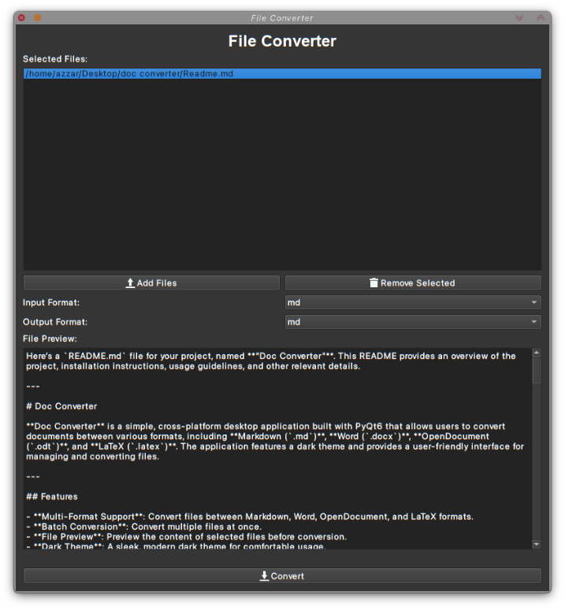

# Doc Converter

**Doc Converter** is a simple, cross-platform desktop application built with PyQt6 that allows users to convert documents between various formats, including **Markdown (`.md`)**, **Word (`.docx`)**, **OpenDocument (`.odt`)**, and **LaTeX (`.latex`)**. The application features a dark theme and provides a user-friendly interface for managing and converting files.

------------------------------------------------------------------------

## Features

-   **Multi-Format Support**: Convert files between Markdown, Word, OpenDocument, and LaTeX formats.
-   **Batch Conversion**: Convert multiple files at once.
-   **File Preview**: Preview the content of selected files before conversion.
-   **Dark Theme**: A sleek, modern dark theme for comfortable usage.
-   **Progress Feedback**: A progress bar shows the status of the conversion process.
-   **Cross-Platform**: Works on Windows, macOS, and Linux.

------------------------------------------------------------------------

## Supported Formats

  Input Formats           Output Formats
  ----------------------- -----------------------
  Markdown (`.md`)        Markdown (`.md`)
  Word (`.docx`)          Word (`.docx`)
  OpenDocument (`.odt`)   OpenDocument (`.odt`)
  LaTeX (`.latex`)        LaTeX (`.latex`)

------------------------------------------------------------------------

## Installation

### Prerequisites

Before running the application, ensure you have the following installed:

1.  **Python 3.7 or higher**: Download and install Python from [python.org](https://www.python.org/).
2.  **Pandoc**: The application uses `pypandoc`, which requires Pandoc. Install Pandoc from [pandoc.org](https://pandoc.org/installing.html).

### Steps

1.  **Clone the Repository**:

    ``` bash
    git clone https://github.com/1999AZZAR/doc-converter.git
    cd doc-converter
    ```

2.  **Install Dependencies**:
    Install the required Python packages using `pip`:

    ``` bash
    pip install -r requirements.txt
    ```

    Alternatively, install the dependencies manually:

    ``` bash
    pip install PyQt6 pypandoc
    ```

3.  **Run the Application**:
    Execute the script to launch the application:

    ``` bash
    python converted.py
    ```

------------------------------------------------------------------------

## Usage

1.  **Add Files**:
    -   Click the **"Add Files"** button to select one or more files for conversion.
    -   Supported file types: `.md`, `.docx`, `.odt`, `.tex`.
2.  **Select Input and Output Formats**:
    -   Choose the **input format** of the selected files from the dropdown menu.
    -   Choose the **output format** for the converted files.
3.  **Preview Files**:
    -   Click on a file in the list to preview its content in the preview pane.
4.  **Convert Files**:
    -   Click the **"Convert"** button to start the conversion process.
    -   The converted files will be saved in a `converted` folder within the same directory as the input files.
5.  **Monitor Progress**:
    -   A progress bar will show the status of the conversion process.
    -   Once completed, a success message will be displayed.

------------------------------------------------------------------------

## Screenshots



------------------------------------------------------------------------

## Contributing

Contributions are welcome! If you'd like to contribute to the project, please follow these steps:

1.  Fork the repository.
2.  Create a new branch for your feature or bugfix.
3.  Commit your changes and push to your branch.
4.  Submit a pull request with a detailed description of your changes.

------------------------------------------------------------------------

## License

This project is licensed under the **MIT License**. See the [LICENSE](LICENSE) file for details.

------------------------------------------------------------------------

## Acknowledgments

-   **PyQt6**: For the GUI framework.
-   **Pandoc**: For the document conversion engine.
-   **pypandoc**: For the Python bindings to Pandoc.

------------------------------------------------------------------------

## Contact

For questions, feedback, or support, please open an issue on the [GitHub repository](https://github.com/1999AZZAR/doc-converter/issues) or contact the maintainer directly.

------------------------------------------------------------------------

Enjoy using **Doc Converter**! 🚀
